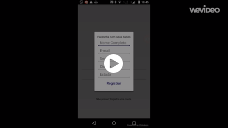
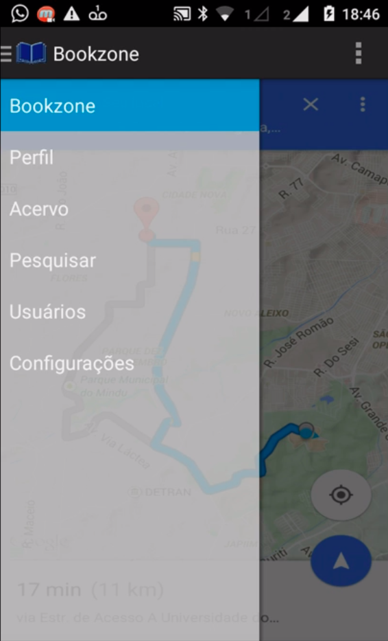

[<- Back to JuninhoCruzG3 projects list](../MyProjectsSummary.md)

[<- Back to JuninhoCruzG3 profile](../../README.md)

# Bookzone

Bookzone is a platform for managing personal libraries, buying, selling and exchanging books. With it, you can search for a book and locate the nearest stores with their respective prices, as well as find ordinary people who are selling or lending the book.

The platform records the loan history of each user's books, with ratings, so that you can have the security of lending books and receiving them back in perfect condition.

The project was developed during the Collaborative Mobile Systems course at the Federal University of Amazonas in 2015.

## Specification

**Authors:** António Cruz Júnior e Helton Soares Nogueira

**Course:** Engenharia de Computação

**Technologies:** 

- **Front-End:** _Android, Java_
- **Back-End:** _PHP, SQLite_

## Video

## Screenshots

Login Page

Menu Principal

Profile Page

Books List

